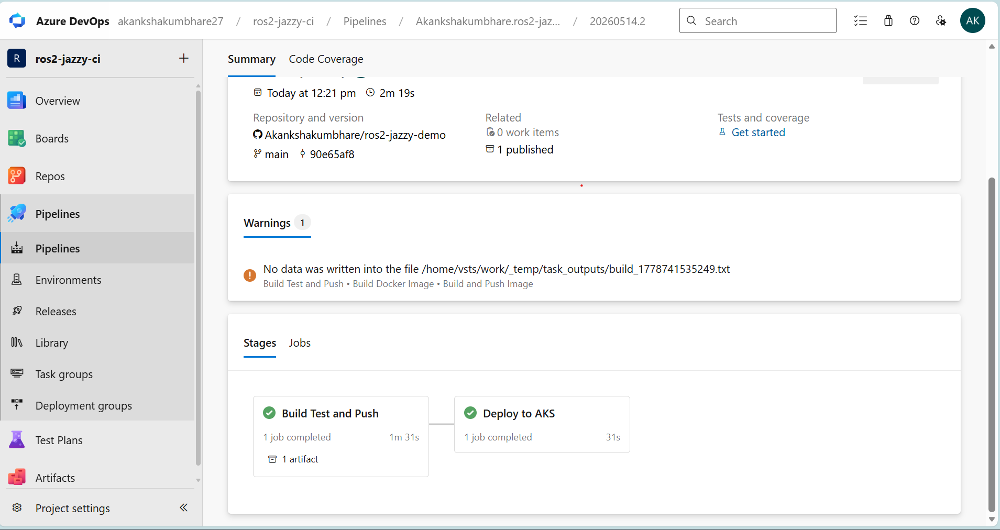

ROS2 Jazzy CI/CD Demo
Project Overview
This project demonstrates a complete CI/CD pipeline implementation for a ROS2 Jazzy application using Azure DevOps, Docker, Azure Kubernetes Service (AKS), Azure Container Registry (ACR), Prometheus, and Grafana.
The solution automatically builds, tests, containerizes, deploys, and monitors a ROS2 application whenever developers push code changes to GitHub.
The demo application uses ROS2 Jazzy minimal publisher/subscriber examples.
High-Level Architecture
Developer Push
      ↓
GitHub Repository
      ↓
Azure DevOps Pipeline
      ↓
Docker Build & Test
      ↓
Azure Container Registry (ACR)
      ↓
Azure Kubernetes Service (AKS)
      ↓
ROS2 Application Pod
      ↓
Prometheus + Grafana Monitoring
Architecture Diagram
 

 
________________________________________
Technologies Used
Technology	Purpose
Docker	Containerization
Azure DevOps	CI/CD pipeline
Azure Container Registry	Container image storage
Azure Kubernetes Service	Container orchestration
Kubernetes	Deployment platform
Prometheus	Metrics collection
Grafana	Monitoring dashboard
Helm	Kubernetes package management
GitHub	Source control
________________________________________
CI/CD Pipeline
The Azure DevOps pipeline automatically performs the following actions on every commit:
1.	Pull latest source code from GitHub
2.	Build Docker image
3.	Start ROS2 container
4.	Validate ROS2 publisher logs
5.	Publish build artifacts
6.	Push Docker image to Azure Container Registry
7.	Deploy application to AKS cluster
Pipeline file:
azure-pipelines.yml
________________________________________
Docker Build
Docker is used to package the ROS2 Jazzy application into a portable container.
Dockerfile
FROM ros:jazzy-ros-base

RUN apt-get update && apt-get install -y \
    ros-jazzy-examples-rclcpp-minimal-publisher \
    ros-jazzy-examples-rclcpp-minimal-subscriber \
    && rm -rf /var/lib/apt/lists/*

CMD ["ros2", "run", "examples_rclcpp_minimal_publisher", "publisher_member_function"]
Build Locally
docker build -t ros2-jazzy-demo .
Run Locally
docker run ros2-jazzy-demo
________________________________________
Azure Container Registry
Docker images are stored securely in Azure Container Registry.
Example registry:
ros2registry.azurecr.io
Images are automatically pushed during CI/CD execution.
________________________________________
AKS Deployment
The ROS2 application is deployed to Azure Kubernetes Service using Kubernetes manifests.
Deployment Files
k8s/deployment.yaml
k8s/service.yaml
k8s/ingress.yaml
Deploy Manually
kubectl apply -f k8s/
Verify Deployment
kubectl get pods
kubectl get services
kubectl get ingress
________________________________________
Monitoring
Monitoring is implemented using Prometheus and Grafana.
Components
•	Prometheus for metrics collection
•	Grafana for visualization
•	Kubernetes logs for troubleshooting
Installed Using Helm
helm install prometheus prometheus-community/prometheus

helm install grafana grafana/grafana
Grafana Dashboard
 
Dashboard JSON export:
monitoring/grafana-kubernetes-dashboard.json
________________________________________
TLS / Security
The solution includes Kubernetes ingress with TLS support.
Security Features
•	Kubernetes TLS secret
•	NGINX Ingress Controller
•	Private Azure Container Registry authentication
•	Container isolation
•	Immutable Docker images
•	Automated CI/CD deployment
•	Artifact traceability
TLS Components
k8s/ingress.yaml
________________________________________
Logs and Metrics
View ROS2 Logs
kubectl logs deployment/ros2-publisher
View Cluster Metrics
Grafana dashboards provide:
•	CPU utilization
•	Memory usage
•	Network traffic
•	Pod health
•	Kubernetes cluster monitoring
________________________________________
________________________________________
How to Run Locally
Clone Repository
git clone https://github.com/Akankshakumbhare/ros2-jazzy-demo.git
Build Docker Image
docker build -t ros2-jazzy-demo .
Run Container
docker run ros2-jazzy-demo
Deploy to Kubernetes
kubectl apply -f k8s/
________________________________________
Production Improvements
The following improvements can be added for production environments:
Improvement	Benefit
Trivy image scanning	Container security
SonarQube integration	Code quality analysis
Helm charts	Reusable Kubernetes deployments
ArgoCD	GitOps deployment
cert-manager	Automatic TLS certificate renewal
HPA autoscaling	Automatic scaling
Azure Monitor	Centralized observability
Multi-stage Docker builds	Smaller container images
ROS2 tracing	Advanced robotics observability
________________________________________
Screenshots
Azure DevOps Pipeline
  
AKS Pods
 

Grafana Dashboard

 ________________________________________
Conclusion
This project demonstrates a complete end-to-end CI/CD implementation for ROS2 Jazzy applications using modern DevOps practices.
The solution provides:
•	Automated build and testing
•	Containerized ROS2 deployment
•	Kubernetes orchestration
•	Centralized monitoring
•	Secure image management
•	Scalable cloud-native deployment architecture
The implementation is designed to be easy to maintain, troubleshoot, extend, and adapt for production robotics environments.

