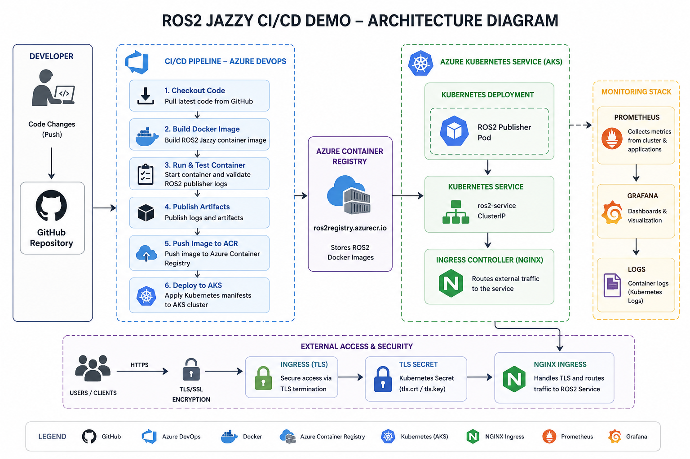
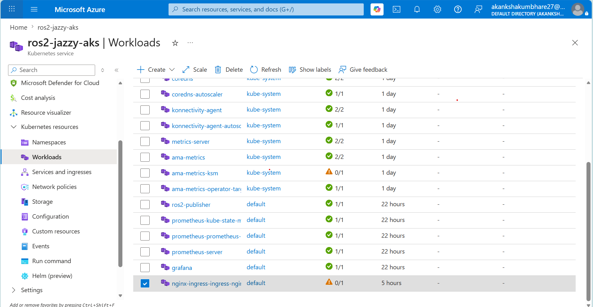
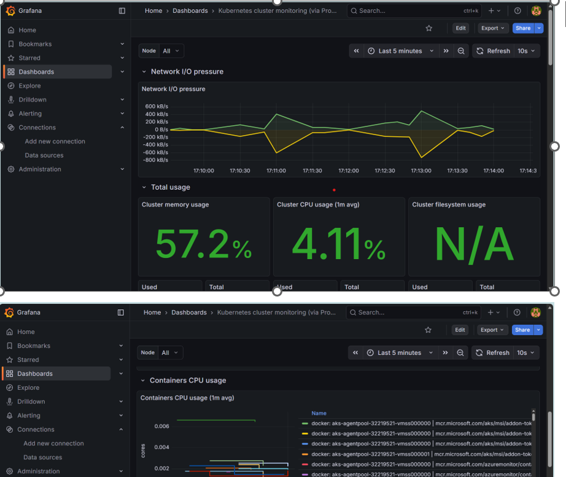

# ROS2 Jazzy CI/CD Demo

## Project Overview

This project demonstrates a complete CI/CD pipeline implementation for a ROS2 Jazzy application using:

- Azure DevOps
- Docker
- Azure Kubernetes Service (AKS)
- Azure Container Registry (ACR)
- Prometheus
- Grafana

The solution automatically builds, tests, containerizes, deploys, and monitors a ROS2 application whenever developers push code changes to GitHub.

---

# High-Level Architecture

```text
Developer Push
      ↓
GitHub Repository
      ↓
Azure DevOps Pipeline
      ↓
Docker Build & Test
      ↓
Azure Container Registry (ACR)
      ↓
Azure Kubernetes Service (AKS)
      ↓
ROS2 Application Pod
      ↓
Prometheus + Grafana Monitoring
```

---

# Architecture Diagram



---

# Technologies Used

| Technology | Purpose |
|---|---|
| Docker | Containerization |
| Azure DevOps | CI/CD pipeline |
| Azure Container Registry | Container image storage |
| Azure Kubernetes Service | Container orchestration |
| Kubernetes | Deployment platform |
| Prometheus | Metrics collection |
| Grafana | Monitoring dashboard |
| Helm | Kubernetes package management |
| GitHub | Source control |

---

# CI/CD Pipeline

The Azure DevOps pipeline automatically performs:

1. Pull latest source code from GitHub
2. Build Docker image
3. Start ROS2 container
4. Validate ROS2 publisher logs
5. Publish build artifacts
6. Push Docker image to Azure Container Registry
7. Deploy application to AKS cluster

Pipeline file:

```text
azure-pipelines.yml
```

---

# Docker Build

## Dockerfile

```dockerfile
FROM ros:jazzy-ros-base

RUN apt-get update && apt-get install -y \
    ros-jazzy-examples-rclcpp-minimal-publisher \
    ros-jazzy-examples-rclcpp-minimal-subscriber \
    && rm -rf /var/lib/apt/lists/*

CMD ["ros2", "run", "examples_rclcpp_minimal_publisher", "publisher_member_function"]
```

## Build Locally

```bash
docker build -t ros2-jazzy-demo .
```

## Run Locally

```bash
docker run ros2-jazzy-demo
```

---

# Azure Container Registry

Docker images are securely stored in Azure Container Registry.

Example:

```text
ros2registry.azurecr.io
```

---

# AKS Deployment

Deployment manifests:

```text
k8s/deployment.yaml
k8s/service.yaml
k8s/ingress.yaml
```

Deploy manually:

```bash
kubectl apply -f k8s/
```

Verify:

```bash
kubectl get pods
kubectl get services
kubectl get ingress
```

---

# Monitoring

Monitoring stack includes:

- Prometheus
- Grafana
- Kubernetes logs

Installed using Helm:

```bash
helm install prometheus prometheus-community/prometheus

helm install grafana grafana/grafana
```

Dashboard export:

```text
monitoring/grafana-kubernetes-dashboard.json
```

---

# TLS / Security

Security features include:

- Kubernetes TLS secret
- NGINX Ingress Controller
- Private Azure Container Registry authentication
- Immutable Docker images

TLS configuration:

```text
k8s/ingress.yaml
```

---

# Logs and Metrics

View ROS2 logs:

```bash
kubectl logs deployment/ros2-publisher
```

Grafana dashboards provide:

- CPU utilization
- Memory usage
- Network traffic
- Pod health

---

# How to Run Locally

## Clone Repository

```bash
git clone https://github.com/Akankshakumbhare/ros2-jazzy-demo.git
```

## Build Docker Image

```bash
docker build -t ros2-jazzy-demo .
```

## Run Container

```bash
docker run ros2-jazzy-demo
```

## Deploy to Kubernetes

```bash
kubectl apply -f k8s/
```

---

# Production Improvements

| Improvement | Benefit |
|---|---|
| Trivy image scanning | Container security |
| SonarQube integration | Code quality |
| Helm charts | Reusable deployments |
| ArgoCD | GitOps deployment |
| cert-manager | Automatic TLS renewal |
| HPA autoscaling | Automatic scaling |
| Azure Monitor | Centralized observability |

---

# Screenshots

## AKS Pods



## Azure Pipeline


## Grafana Dashboard



---

# Conclusion

This project demonstrates a complete end-to-end CI/CD implementation for ROS2 Jazzy applications using modern DevOps practices.

The solution provides:

- Automated build and testing
- Containerized ROS2 deployment
- Kubernetes orchestration
- Centralized monitoring
- Secure image management
- Scalable cloud-native architecture

